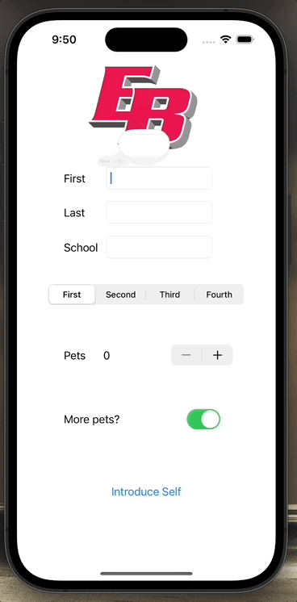

# Introduction iOS App

This is a Introduction app that allows users to introduce themselves by providing their name, school name, academic year, number of pets they own, and if they want more pets.

## Features

- Input fields for first name, last name, and school name.
- Segmented control to select the academic year.
- Stepper to select the number of pets owned.
- Switch to indicate whether the user wants more pets.
- Introduce button to generate an introduction based on the provided information.
- Alert to display the generated introduction.

## Technology

This app is built using the Swift programming language and utilizes the UIKit framework for building the user interface.

## GIF Walkthrough

## License

This project is licensed under the MIT License.
